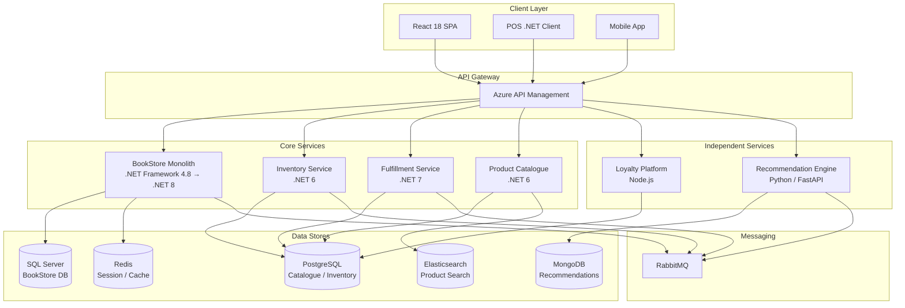
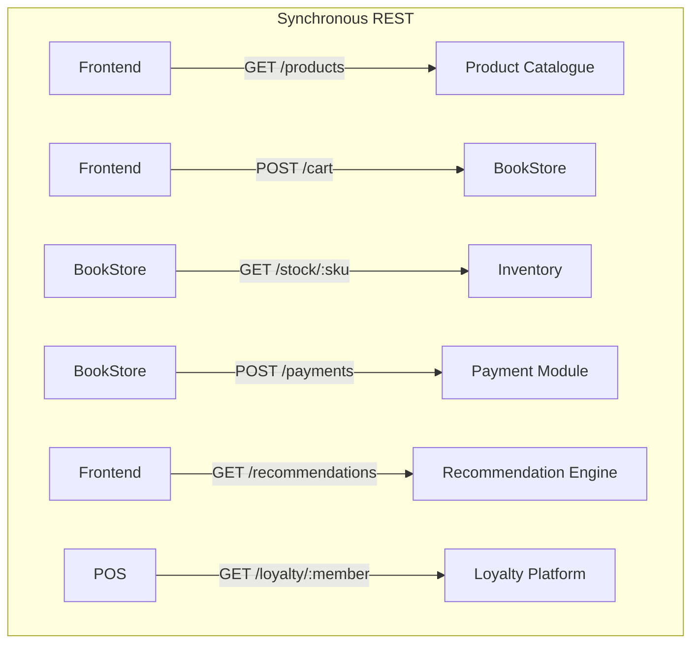
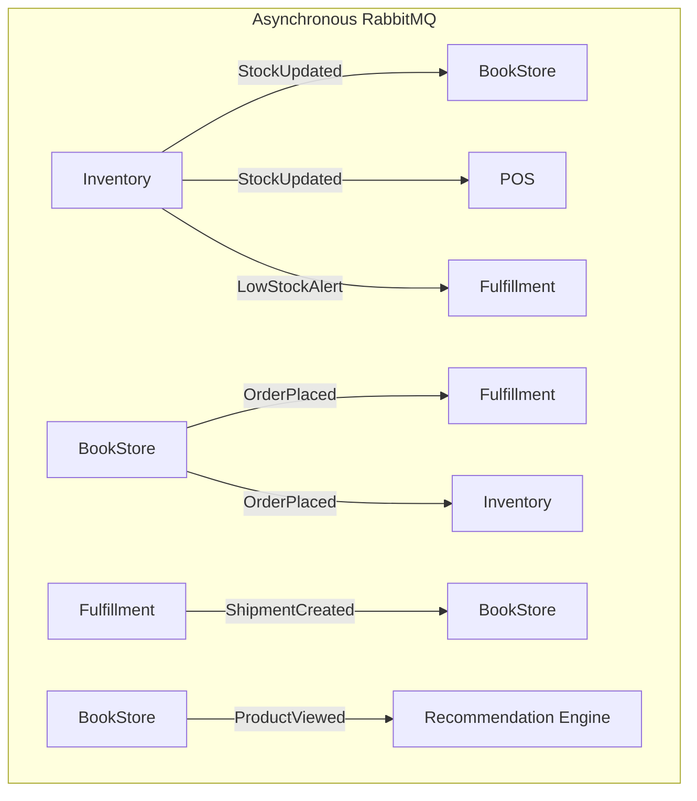
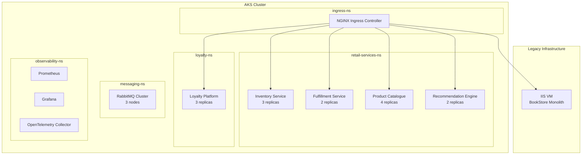

# Architecture Overview — Acme Retail

## Purpose

This document provides a comprehensive overview of the Acme Retail technology architecture, covering its historical evolution, current system landscape, communication patterns, data architecture principles, and deployment topology. It serves as the primary reference for engineering teams, architects, and technical leadership when onboarding, planning changes, or evaluating integration points.

For the full system landscape diagram and service registry, see [System Landscape](../technical/system-landscape.md). For business context, see [Business Overview](../business/overview.md).

---

## Architecture Evolution

Acme Retail's architecture has evolved through three distinct phases over the past fifteen years, each driven by business growth, shifting market demands, and the need for greater engineering agility.

### Phase 1: Monolithic Era (2008–2014)

The original Acme Retail platform was built as a single monolithic application known internally as **BookStore**. It was developed on ASP.NET MVC running on .NET Framework 4.x, backed by Microsoft SQL Server for all persistent data. The application was hosted on Internet Information Services (IIS) deployed to Windows Server virtual machines managed on-premises and later in Azure classic cloud services.

During this phase, all retail capabilities — product browsing, shopping cart, checkout, order management, user accounts, loyalty, and back-office administration — lived within a single deployable unit. This approach served the business well in the early years: teams were small, the product catalogue was limited to several thousand SKUs, and the release cadence of quarterly deployments was acceptable.

Key characteristics of the Phase 1 architecture:

- **Single codebase** — all features in one Visual Studio solution (~320 projects at peak)
- **Shared SQL Server database** — a single `RetailDB` instance with 400+ tables
- **Session-affinity IIS hosting** — sticky sessions on a pair of load-balanced VMs
- **Batch processing** — nightly SQL Agent jobs for inventory reconciliation, reporting, and loyalty point calculations
- **Tightly coupled integrations** — point-to-point connections to ERP (SAP), warehouse management, and payment processors via WCF services

By 2014, the monolith had become a significant bottleneck. Deployment cycles stretched to three weeks due to regression testing overhead, and merge conflicts in the shared codebase were a daily occurrence across the five development teams.

### Phase 2: Initial Decomposition (2015–2019)

Recognizing the limitations of the monolith, the engineering leadership initiated a strategic decomposition effort guided by domain-driven design principles. Rather than a full rewrite, the team adopted a pragmatic approach: extract capabilities that had the highest rate of change or the strongest independent scaling requirements.

**Loyalty Platform** — The first service extracted was the Loyalty Platform, built on Node.js with Express. Loyalty had distinct business rules, a separate data model, and a high rate of feature requests from the marketing team. It was deployed independently and communicated with BookStore via REST APIs.

**Product Catalogue** — The Product Catalogue was extracted next, motivated by the need for advanced search capabilities. The team introduced Elasticsearch as the primary read store for product data, enabling faceted search, autocomplete, and relevance tuning. Product data continued to be mastered in PostgreSQL, with Elasticsearch populated via a synchronization pipeline.

**Point-of-Sale (POS) Rebuild** — The in-store POS system, previously a Windows Forms thick client, was rebuilt as a .NET Core application with a REST API backend. This allowed the POS to run on modern hardware and share product and pricing data with the online platform through the Product Catalogue service.

By the end of Phase 2, the architecture was a hybrid: the BookStore monolith still handled the majority of e-commerce flows, but three significant capabilities had been extracted into independently deployable services.

### Phase 3: Microservices and Modernization (2020–Present)

The current phase focuses on completing the decomposition of the BookStore monolith and modernizing the technology stack.

**Inventory Management Service** — Extracted from BookStore to enable real-time stock visibility across all channels (online, in-store, warehouse). Built on .NET 6, it uses event sourcing to maintain a complete audit trail of all stock movements.

**Order Fulfillment Service** — Handles pick, pack, ship workflows and carrier integration. Built on .NET 7, it consumes order events from BookStore and publishes fulfillment status updates.

**RabbitMQ Introduction** — Asynchronous messaging was introduced via RabbitMQ to decouple services and enable event-driven workflows. This replaced the previous pattern of synchronous API polling and significantly reduced inter-service latency and coupling.

**BookStore .NET 8 Migration** — The BookStore monolith is being incrementally migrated from .NET Framework 4.8 to .NET 8 using the strangler fig pattern. See [ADR-003](adr/ADR-003-dotnet8-modernization.md) for details.

**Recommendation Engine** — A new service built on Python with FastAPI, leveraging collaborative filtering and content-based algorithms. It consumes product view events and purchase history to generate personalized recommendations served via a REST API.

---

## Current Architecture State

The following diagram illustrates the current system landscape at a high level:

### BookStore Monolith

The BookStore monolith remains the central component of the Acme Retail platform. It currently handles:

- **Product browsing** (partially — being delegated to Product Catalogue)
- **Shopping cart and checkout**
- **Order management** (order creation; fulfillment delegated to Fulfillment Service)
- **User accounts and authentication** (ASP.NET Identity, migrating to centralized Identity Server)
- **Back-office administration** (product management, pricing, promotions, reporting)
- **Payment processing** (tightly coupled module — see below)

The monolith is being progressively hollowed out using the **strangler fig pattern**: new capabilities are built as microservices, and existing capabilities are extracted incrementally. API Gateway routing rules direct traffic to the appropriate service, with BookStore serving as the fallback. For detailed technical documentation on BookStore, see [BookStore E-Commerce](../technical/bookstore-ecommerce.md).

### Extracted Microservices

| Service | Runtime | Database | Primary Responsibility |
|---|---|---|---|
| Inventory Management | .NET 6 | PostgreSQL | Real-time stock levels, reservations, reorder triggers |
| Order Fulfillment | .NET 7 | PostgreSQL | Pick/pack/ship workflows, carrier integration, tracking |
| Product Catalogue | .NET 6 | PostgreSQL (write) / Elasticsearch (read) | Product data management, search, faceted navigation |

### Independent Services

| Service | Runtime | Database | Primary Responsibility |
|---|---|---|---|
| Loyalty Platform | Node.js 20 / Express | PostgreSQL | Points accrual, redemption, tier management, campaigns |
| Recommendation Engine | Python 3.11 / FastAPI | MongoDB | Personalized product recommendations, trending products |

### Payment Module

The Payment Module is currently tightly coupled within the BookStore monolith. It handles credit card processing (via Stripe), gift card redemption, loyalty point payments, and invoicing for B2B customers. Extracting the Payment Module is the next major modernization initiative, planned for Q3 2025. This extraction is complex due to PCI DSS compliance requirements, transactional integrity constraints with the checkout flow, and the need for synchronous payment confirmation during order placement.

---

## Communication Patterns

### Synchronous Communication (REST/HTTP)

Synchronous REST APIs are used for operations that require an immediate response, such as:

- Product search queries from the frontend to Product Catalogue
- Cart operations from the frontend to BookStore
- Stock availability checks from BookStore to Inventory Management
- Payment authorization from BookStore to the Payment Module (internal)

All synchronous inter-service communication passes through Azure API Management, which provides rate limiting, authentication, request transformation, and observability.

### Asynchronous Communication (RabbitMQ)

Event-driven messaging via RabbitMQ is used for operations where eventual consistency is acceptable and decoupling is desired. See [ADR-002](adr/ADR-002-event-driven-inventory.md) for the rationale behind this decision.

Key event flows include:

- **Inventory events**: `StockUpdated`, `LowStockAlert`, `ReorderTriggered`
- **Order events**: `OrderPlaced`, `OrderCancelled`, `OrderRefunded`
- **Fulfillment events**: `ShipmentCreated`, `ShipmentDelivered`, `ReturnInitiated`
- **Product events**: `ProductCreated`, `ProductUpdated`, `PriceChanged`
- **User activity events**: `ProductViewed`, `ProductAddedToCart`, `PurchaseCompleted` (consumed by Recommendation Engine)

RabbitMQ is configured with topic exchanges, allowing consumers to subscribe to specific event patterns. Dead-letter queues are configured for all consumers to capture failed messages for investigation and replay.

### Communication Matrix

| Producer | Event | Consumers | Protocol | Latency SLA |
|---|---|---|---|---|
| Inventory Service | `StockUpdated` | BookStore, POS, Fulfillment, Recommendation Engine | RabbitMQ | < 500ms |
| Inventory Service | `LowStockAlert` | Fulfillment, Admin Dashboard | RabbitMQ | < 1s |
| BookStore | `OrderPlaced` | Fulfillment, Inventory, Loyalty | RabbitMQ | < 500ms |
| BookStore | `ProductViewed` | Recommendation Engine | RabbitMQ | Best effort |
| Fulfillment | `ShipmentCreated` | BookStore, Notification Service | RabbitMQ | < 2s |
| Product Catalogue | `ProductUpdated` | BookStore, Recommendation Engine, POS | RabbitMQ | < 1s |
| Product Catalogue | `PriceChanged` | BookStore, POS, Loyalty | RabbitMQ | < 500ms |

---

## Data Architecture Principles

### Database-per-Service

Each microservice owns its data store exclusively. No service directly accesses another service's database. Data is shared only through well-defined APIs and events. This principle is enforced through network segmentation — each service's database is accessible only from that service's Kubernetes namespace.

| Service | Primary Data Store | Purpose |
|---|---|---|
| BookStore | SQL Server | Orders, users, cart, payments, admin |
| Product Catalogue | PostgreSQL + Elasticsearch | Product master data (write) + search index (read) |
| Inventory Management | PostgreSQL | Stock levels, reservations, movement history (event-sourced) |
| Order Fulfillment | PostgreSQL | Shipments, carrier data, tracking |
| Loyalty Platform | PostgreSQL | Members, points, tiers, campaigns |
| Recommendation Engine | MongoDB | User profiles, product vectors, model artifacts |

### Event Sourcing (Inventory)

The Inventory Management Service uses event sourcing to maintain a complete, immutable history of all stock movements. Rather than storing only the current stock level, every change is recorded as an event (`StockReceived`, `StockReserved`, `StockShipped`, `StockAdjusted`). The current state is derived by replaying events. This approach provides:

- Full audit trail for compliance and dispute resolution
- Ability to reconstruct stock state at any point in time
- Natural integration with event-driven architecture (events are the source of truth and can be published to RabbitMQ)

### CQRS in Product Catalogue

The Product Catalogue implements the Command Query Responsibility Segregation (CQRS) pattern:

- **Write side**: PostgreSQL serves as the authoritative store for product data. All create, update, and delete operations target PostgreSQL.
- **Read side**: Elasticsearch serves as the optimized read store for product search, faceted navigation, and autocomplete. It is populated asynchronously from PostgreSQL via a change data capture pipeline.

This separation allows the read and write sides to scale independently. Product search queries, which constitute over 90% of traffic to the Product Catalogue, are served entirely from Elasticsearch without touching PostgreSQL.

### Event-Driven Data Synchronization

Cross-service data synchronization is achieved exclusively through RabbitMQ events. For example, when a product price changes in the Product Catalogue, a `PriceChanged` event is published. BookStore, POS, and Loyalty each consume this event and update their local projections accordingly. This ensures eventual consistency while maintaining service autonomy.

---

## Deployment Architecture

### Kubernetes (AKS)

All microservices (Inventory, Fulfillment, Product Catalogue, Loyalty, Recommendation Engine) are deployed to **Azure Kubernetes Service (AKS)**. Each service is packaged as a Docker container and deployed using Helm charts.

### Helm Charts and GitOps

All Kubernetes manifests are managed as Helm charts stored in the `acme-retail-infra` repository. Deployments are managed via **Flux CD** (GitOps):

1. Engineers merge changes to the `main` branch of the infrastructure repository
2. Flux detects the change and reconciles the cluster state
3. Helm releases are upgraded automatically
4. Rollback is triggered automatically if health checks fail within the configured window

### BookStore Deployment (Legacy)

The BookStore monolith is currently deployed to IIS on Windows Server 2019 VMs behind an Azure Application Gateway. As the .NET 8 migration progresses, components are being re-deployed to AKS running Kestrel. The Admin panel is the first module running on AKS (since Q4 2024). The API layer migration to AKS is scheduled for Q2 2025.

### Environments

| Environment | Purpose | Infrastructure | Deployment Trigger |
|---|---|---|---|
| **Dev** | Developer integration testing | Shared AKS cluster (dev namespace) | Push to `develop` branch |
| **PR Preview** | Pull request validation | Ephemeral AKS namespace per PR | Pull request opened/updated |
| **Staging** | Pre-production validation, performance testing | Dedicated AKS cluster (production-mirrored) | Merge to `main` branch |
| **Production** | Live customer-facing traffic | Dedicated AKS cluster (multi-zone) | Manual approval gate after staging validation |

### CI/CD Pipeline

The CI/CD pipeline is built on **GitHub Actions** with Flux CD handling the deployment leg:

1. **Build** — GitHub Actions builds Docker images on every push, runs unit tests, SAST scans (CodeQL), and dependency vulnerability checks (Dependabot)
2. **Test** — Integration tests run against ephemeral environments spun up in the PR Preview namespace
3. **Publish** — On merge to `main`, images are tagged with semantic versions and pushed to Azure Container Registry (ACR)
4. **Deploy** — Flux CD detects the new image tag in the infrastructure repository and reconciles the target environment
5. **Verify** — Post-deployment health checks and smoke tests validate the deployment; automated rollback on failure

---

## Related Documents

- [System Landscape](../technical/system-landscape.md) — Detailed service registry and dependency map
- [Business Overview](../business/overview.md) — Business context, capabilities, and strategic priorities
- [BookStore E-Commerce](../technical/bookstore-ecommerce.md) — Technical deep-dive into the BookStore monolith
- [ADR-001: Microservices Extraction](adr/ADR-001-microservices-extraction.md) — Decision record for decomposition strategy
- [ADR-002: Event-Driven Inventory](adr/ADR-002-event-driven-inventory.md) — Decision record for RabbitMQ adoption
- [ADR-003: .NET 8 Modernization](adr/ADR-003-dotnet8-modernization.md) — Decision record for runtime migration
