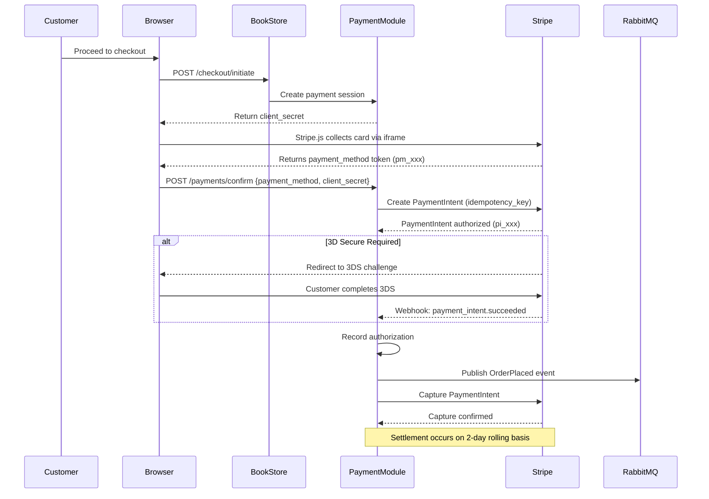

# Payment Module

## Architecture Overview

The **Payment Module** is the component responsible for all payment processing within Acme Retail's eCommerce and point-of-sale operations. Unlike the majority of Acme Retail's service portfolio, which has been migrated to .NET 6+ microservices on AKS, the Payment Module remains on the **.NET Framework 4.8** runtime. It is the last major legacy component in the Acme Retail technology estate and runs on IIS within the same Windows Server infrastructure as the BookStore monolith, though in a dedicated application pool with isolated memory and CPU resources.

The module's persistence layer is **SQL Server 2019**, hosted on an Azure SQL Managed Instance within a PCI-scoped network segment. The database stores order payment records, transaction audit logs, refund histories, and references to Stripe payment objects (tokens and intent IDs — never raw card data). The decision to retain SQL Server for the Payment Module reflects both the tight coupling to the BookStore monolith's shared transaction model and the regulatory requirements that make database migrations in PCI-scoped environments particularly complex.

The Payment Module is tightly coupled to the BookStore checkout flow, sharing session state and referencing the BookStore's order model directly through database views. This coupling is recognized as significant technical debt and is a primary driver behind the planned modernization effort documented in [ADR-003](../architecture/adr-003-payment-modernization.md). The modernization will extract the Payment Module into an independent .NET 8 microservice with its own PostgreSQL database, communicating with the BookStore via RabbitMQ events rather than shared database access.

The Payments team consists of six engineers, all of whom hold current PCI-DSS training certifications. The team operates under stricter change management controls than other Acme Retail teams: every code change requires peer review from a PCI-certified reviewer, and deployments follow a dedicated release pipeline with additional security gates. On-call responsibility rotates weekly among the senior engineers, with escalation to the InfoSec team for security-related incidents.

## Payment Flow

The payment lifecycle at Acme Retail follows a seven-step process designed to ensure that sensitive card data never touches Acme servers, that every transaction is idempotent, and that all state transitions are auditable.

### Step 1 — Cart to Checkout Initiation

When a customer clicks "Proceed to Checkout" in the BookStore front end, the browser sends a request to the BookStore API, which validates the cart contents, calculates totals (including tax and shipping), and delegates to the Payment Module to create a payment session. The Payment Module generates a Stripe PaymentIntent with the order total and returns the `client_secret` to the browser. This secret is used by Stripe.js on the client side and never grants the ability to capture funds on its own.

### Step 2 — Client-Side Tokenization

Card data collection is handled entirely by **Stripe.js**, which renders a secure iframe embedded in the checkout page. The customer enters their card number, expiration date, and CVC directly into the Stripe-hosted iframe. At no point does card data pass through Acme Retail's servers, network, or JavaScript. Stripe.js tokenizes the card details and returns a `payment_method` token (prefixed `pm_`) to the browser. This tokenization boundary is a foundational element of Acme Retail's PCI-DSS compliance posture, documented in detail in [PCI-DSS Compliance](../security/pci-dss-compliance.md).

### Step 3 — Payment Intent Creation

The browser submits the `payment_method` token and the `client_secret` to the Payment Module's confirmation endpoint. The Payment Module then calls the Stripe Payment Intents API to associate the payment method with the previously created PaymentIntent. Every API call to Stripe includes an **idempotency key** formatted as `{orderId}_{attempt}`, ensuring that retries caused by network failures or timeouts do not result in duplicate charges.

### Step 4 — Authorization and 3D Secure

Stripe processes the authorization request with the card's issuing bank. If the transaction is flagged for Strong Customer Authentication (SCA) or the card is enrolled in 3D Secure, Stripe handles the challenge flow directly. The customer is redirected to their bank's 3D Secure page, completes the verification, and is returned to the Acme Retail checkout. The Payment Module receives the authorization result via Stripe's webhook mechanism rather than synchronous polling, ensuring resilience against latency in the 3DS flow.

### Step 5 — Order Confirmation

Upon successful authorization, the Payment Module records the authorization in the SQL Server payment ledger and publishes an `OrderPlaced` event to RabbitMQ. This event triggers downstream processes including order fulfillment (consumed by the Order Management Service), inventory reservation (consumed by the Inventory Service), and email confirmation (consumed by the Notifications Service). The event payload includes the order ID, customer ID, total amount, and payment intent reference — but never any card or payment method details.

### Step 6 — Capture

For standard orders, capture occurs automatically at the time of authorization (auto-capture). For pre-order items where fulfillment may be delayed by weeks or months, the Payment Module uses manual capture: the authorization is placed on hold and captured only when the fulfillment team confirms the order is ready to ship. Uncaptured authorizations are automatically voided after 7 days per Stripe's authorization window.

### Step 7 — Settlement

Stripe settles captured funds to Acme Retail's bank account on a **2-day rolling basis**. Settlement reports are reconciled daily by an automated process that matches Stripe payout line items against the Payment Module's transaction ledger. Discrepancies trigger alerts to the finance operations team for manual investigation.

## Stripe Integration

The Payment Module integrates with Stripe as its sole external payment processor. The integration is pinned to **Stripe API version 2023-10-16**, with a quarterly review cycle to evaluate new API versions and plan upgrades. Pinning the API version prevents breaking changes from affecting production without explicit testing and approval.

The primary integration surface is the **Payment Intents API**, which provides a unified interface for creating, confirming, capturing, and canceling payments. Client-side card collection uses **Stripe.js v3**, loaded from Stripe's CDN to ensure the latest security patches are always in effect.

Stripe communicates asynchronous events to the Payment Module via **webhooks**. The following webhook events are subscribed:

| Webhook Event | Handler Action |
|---|---|
| `payment_intent.succeeded` | Mark payment as authorized, trigger order confirmation |
| `payment_intent.payment_failed` | Record failure, notify customer, increment retry counter |
| `charge.refunded` | Update refund status in ledger, notify customer |
| `charge.dispute.created` | Create dispute case, alert Payments team, freeze order |

Webhook payloads are verified using **HMAC-SHA256 signature validation** against a shared secret stored in Azure Key Vault. The Payment Module rejects any webhook request that fails signature verification and logs the attempt as a security event. Webhook processing is idempotent: each event is deduplicated by its Stripe event ID before processing, preventing duplicate state transitions from redelivered webhooks.

Idempotency keys follow the format `{orderId}_{attempt}`, where `attempt` is an incrementing integer starting at 1. This format ensures that a retry for the same order produces a deterministic key, while a genuinely new payment attempt for the same order (after a previous failure) generates a distinct key.

## Supported Payment Methods

The Payment Module supports six payment methods, with one additional method planned for the first quarter of 2025.

| Payment Method | Status | Integration | Notes |
|---|---|---|---|
| Credit Card (Visa, Mastercard, Amex) | Active | Stripe Payment Intents | Primary method, ~72% of transactions |
| Debit Card | Active | Stripe Payment Intents | Processed identically to credit cards |
| Apple Pay | Active | Stripe Payment Request API | Available on Safari and iOS devices |
| Google Pay | Active | Stripe Payment Request API | Available on Chrome and Android devices |
| Acme Gift Cards | Active | Custom (internal API) | Balance managed by Loyalty service, combined with card payments |
| Loyalty Points Redemption | Active | Custom (internal API) | Points converted at fixed rate ($0.01/point), partial redemption supported |
| PayPal | Planned — Q1 2025 | Stripe PayPal integration | Pending vendor agreement and PCI scope review |

Gift card and loyalty point payments are processed through a custom internal API that interfaces with the Loyalty Program service. These methods can be combined with card payments in a single checkout (split-tender transactions), with the card charged for the remaining balance after gift card or loyalty point deductions.

## Refund and Dispute Handling

Acme Retail supports both full and partial refunds through the Stripe Refunds API. Refund eligibility is governed by business rules enforced by the Payment Module.

**Full refunds** are available within 30 calendar days of the original purchase date. The Payment Module calls the Stripe Refunds API with the original PaymentIntent ID and the full captured amount. Stripe processes the refund back to the customer's original payment method. The refund SLA requires initiation within 24 hours of approval and return of funds to the customer within 5 to 10 business days, depending on the issuing bank's processing time.

**Partial refunds** are supported for scenarios such as partial order returns, damaged item claims, or goodwill adjustments. The refund amount is validated against the remaining refundable balance for the original transaction. Multiple partial refunds can be issued against a single transaction until the total refunded amount equals the original captured amount.

**Disputes and chargebacks** follow a structured workflow. When Stripe notifies the Payment Module of a new dispute via the `charge.dispute.created` webhook, the system automatically creates a dispute case record, freezes the associated order to prevent further fulfillment actions, and alerts the Payments team via PagerDuty. The team then has 7 days (per card network rules) to gather evidence and submit a response through the Stripe Dashboard or API. Evidence typically includes order confirmation emails, shipping tracking information, delivery proof, and customer communication logs. Dispute outcomes are tracked in the payment ledger, and dispute rates are monitored as a key operational metric — Stripe's acceptable threshold is below 0.75% of transactions.

## Fraud Prevention

Fraud prevention at Acme Retail operates at multiple layers, combining Stripe's machine learning capabilities with custom business rules enforced by the Payment Module.

**Stripe Radar** is enabled on all transactions and provides real-time risk scoring based on Stripe's global fraud detection models. The Payment Module configures the following custom Radar rules:

| Rule | Condition | Action |
|---|---|---|
| High-risk geography | Billing or IP address in restricted country list | Block transaction |
| High-value review | Transaction amount exceeds $500 | Place in manual review queue |
| Repeated failures | More than 3 failed payment attempts per hour from the same IP address | Block IP for 1 hour |
| Elevated risk score | Stripe Radar risk score exceeds 85 (out of 100) | Block transaction, alert Payments team |

**Address Verification Service (AVS)** is required for all US-issued cards. The Payment Module checks the AVS response code returned by Stripe and declines transactions where neither the street address nor the ZIP code matches the issuing bank's records. International cards are exempt from AVS checks due to inconsistent global support.

**CVC verification** is mandatory for all card-not-present transactions. Stripe validates the CVC during tokenization, and the Payment Module rejects any payment method token where CVC verification did not return a pass result.

**Velocity controls** enforce rate limits at the customer and session level to prevent automated fraud attacks:

- Maximum 5 orders per customer per hour
- Maximum $2,000 in total charges per customer per calendar day
- Maximum 10 payment attempts (successful or failed) per session within 30 minutes

Velocity violations trigger an automatic block on the customer's account, requiring manual review and clearance by the fraud operations team before further purchases are permitted.

## PCI Compliance Scope

The Payment Module operates within a carefully defined PCI-DSS compliance boundary. Acme Retail maintains **SAQ A-EP** (Self-Assessment Questionnaire A for E-commerce merchants with Partial Electronic Payment Processing) compliance, reflecting the architecture in which card data is collected client-side by Stripe.js but the payment page is served from Acme Retail's infrastructure.

All communication between the Payment Module and Stripe uses **TLS 1.2 or higher**. TLS 1.0 and 1.1 are explicitly disabled at the IIS and Azure load balancer levels. The checkout pages that embed Stripe.js enforce **Content Security Policy (CSP) headers** that restrict script sources to Acme Retail's own domain and Stripe's JavaScript CDN, mitigating the risk of cross-site scripting attacks that could intercept card data.

**Quarterly Approved Scanning Vendor (ASV) scans** are performed by Qualys against all internet-facing components within the PCI scope. Scan results are reviewed by the InfoSec team, and any findings rated medium or higher must be remediated before the next quarterly cycle. The full PCI-DSS compliance program, including network segmentation, logging requirements, vulnerability management schedules, and incident response procedures, is documented in [PCI-DSS Compliance](../security/pci-dss-compliance.md).

For architectural context on how the Payment Module fits within the broader Acme Retail platform, see the [Architecture Overview](../architecture/overview.md) and the [BookStore eCommerce Platform](bookstore-ecommerce.md).
